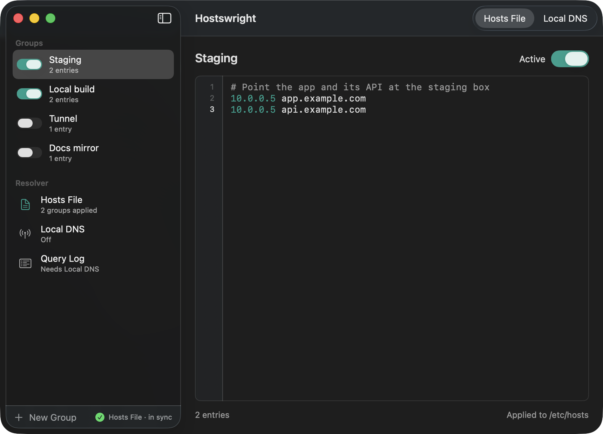
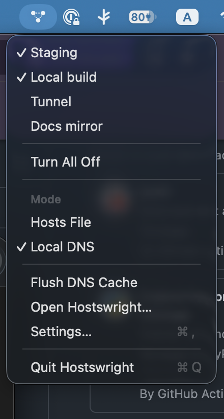
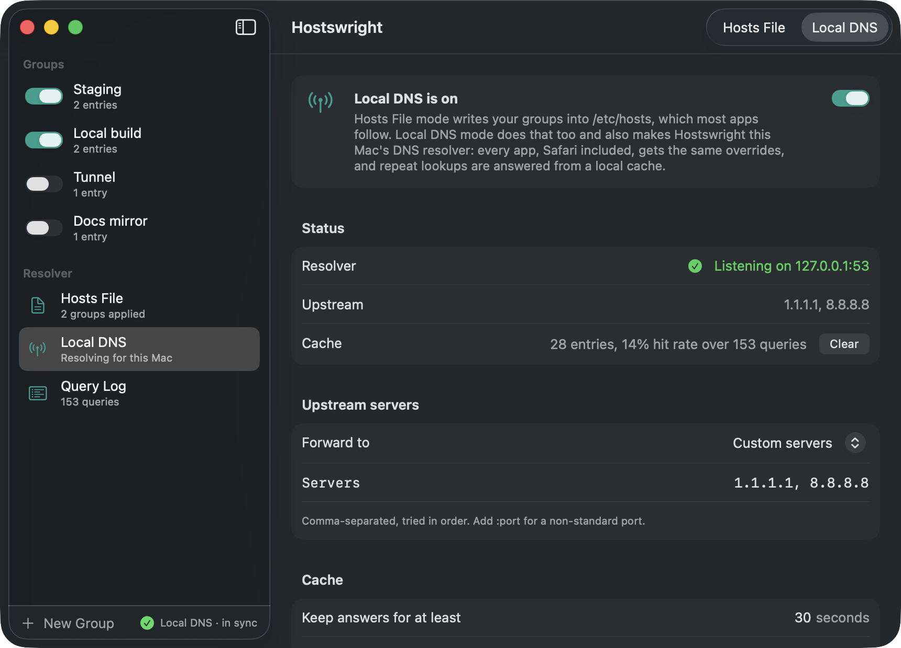
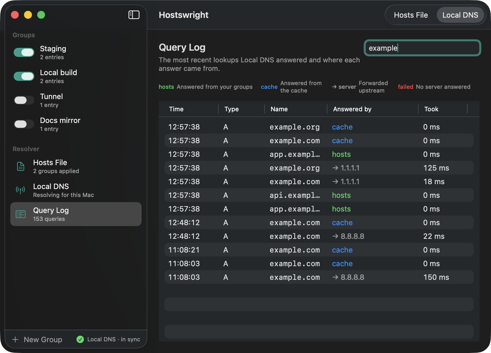

<p align="center">
  
</p>

<h1 align="center">Hostswright</h1>

<p align="center">
  <strong>Switch groups of <code>/etc/hosts</code> entries on and off from the menu bar.</strong><br>
  One approval when you first launch it, then every change lands instantly, with no password prompts.
</p>

<p align="center">
  
  
  
  <a href="LICENSE"></a>
</p>

<p align="center">
  
</p>

## Why Hostswright

Pointing a hostname at a different machine is still the fastest way to test a staging server, a local build, or a tunnel.
Doing it by hand means `sudo`, a text editor, remembering to flush the DNS cache, and undoing it all afterwards.

Hostswright keeps those entries in named groups and turns them into checkboxes in your menu bar.

- **Groups, not files.** Each group is a few lines of hosts entries with a name. Turn on one, several, or none.
- **Instant.** The moment you tick a group, `/etc/hosts` is rewritten and the DNS cache is flushed, so browsers and command line tools see it right away.
- **One-time permission.** A tiny root helper, approved once in System Settings, does the writing. You are never asked for a password again.
- **Your file stays yours.** Hostswright only ever rewrites the section between its own markers. Everything else in `/etc/hosts` is left exactly as it was, and edits you make by hand outside that section are preserved.
- **Native.** SwiftUI, a real menu bar dropdown, light and dark mode, keyboard shortcuts. It looks and behaves like part of macOS.
- **Free and open source.** MIT licensed, no telemetry, no account.

## Features

### Two modes
| Mode | What it does |
|---|---|
| **Hosts File** | Active groups are written into `/etc/hosts`. Most apps and command line tools follow it. The default. |
| **Local DNS** | The hosts file is still written, and Hostswright also becomes the Mac's DNS resolver: every app sees the overrides, and repeat lookups come from a local cache. |

Switch between them with the control in the toolbar or from the menu bar.

### Menu bar
Click the icon to see every group with a checkmark next to the active ones.
Tick and untick as many as you like, pick the mode, and flush the DNS cache without opening the window.
The icon fills in while any group is active, so you can tell at a glance whether overrides are live.

<p align="center">
  
</p>

### Groups
The main window lists your groups in a sidebar with a switch on each row.
The editor is a plain monospaced text area: paste anything a hosts file accepts, including comments.
Bad lines are flagged with the line number and the reason, and the footer shows how many entries the group carries.
Drag to reorder, press ⌫ to delete, ⌘N to add.

### Keeps itself honest
Hostswright watches `/etc/hosts`.
If another tool or a manual edit changes its section, the window and the menu show "Re-apply" until the file matches your groups again.

### Import from an existing setup
If you are coming from SwitchHosts or a hand-maintained file, the System view shows the custom lines it found and offers to import them.
Each blank-line-separated block becomes a group, named after the shared domain or the comment above it, and the adopted lines are removed from the system section so nothing is applied twice.

### Local DNS mode
Local DNS mode makes Hostswright this Mac's resolver.
It answers every name in `/etc/hosts` itself, caches the answers to everything else within the lifetime bounds you choose, and forwards the rest to the DNS servers your network hands out or to a custom list.
Apps that resolve outside the hosts file, Safari included, then see the same overrides.
Forwarding rules send a domain and its subdomains to specific servers, handy for a VPN's internal DNS.
The mode keeps running after you quit the app and after a reboot, and turning it off puts the previous DNS settings back.
iCloud Private Relay resolves Safari traffic through Apple's relay, so overrides do not reach Safari while Private Relay is on.

<p align="center">
  
</p>

### Query log
While Local DNS is on, the Query Log page lists the most recent lookups with the answer's source: your groups, the cache, an upstream server, or a failure.
Filter by name to check what a particular app is resolving.

<p align="center">
  
</p>

## Migrating from SwitchHosts

Both tools write the same file, so quit SwitchHosts first and turn off its Launch at login so the two never race.

**Groups that are switched on.**
SwitchHosts writes only its active groups to `/etc/hosts`.
Open Hostswright, click Import on the empty state or in the System view, and each block becomes a group.
The adopted lines are removed from the system section of the file in the same step, so nothing is applied twice.

**Every group, including switched-off ones.**
SwitchHosts keeps its full list in `~/.SwitchHosts`.
With Hostswright quit, run:

```sh
scripts/import-switchhosts.py
```

It copies each local SwitchHosts group into Hostswright with the same title, order, contents, and on/off state, and leaves groups you already have alone.
Launch Hostswright again and the active groups are applied.
Remote (URL) groups and folders are not migrated; paste those in by hand.

Once you are happy, delete SwitchHosts.
Its data folder can stay as a backup.

## How it works

```
Hostswright.app (menu bar, SwiftUI)  ──XPC──▶  HostswrightHelper (root, launchd)
  owns groups, renders the section              merges the section into /etc/hosts,
  watches the file, shows sync state            writes atomically, flushes DNS
```

- The app never writes `/etc/hosts` itself.
- The helper is registered through Apple's `SMAppService` and started on demand by launchd.
  It accepts connections only from Hostswright signed by the same team.
- Every write re-reads the live file, replaces only the region between the Hostswright markers, writes a temporary file with the original permissions, and renames it into place.
- After each write it runs `dscacheutil -flushcache` and sends `SIGHUP` to `mDNSResponder`.
- In Local DNS mode the helper listens on 127.0.0.1:53 over UDP and TCP, sets that address as the DNS server on every active network service, and saves the previous configuration so it can be restored.
  The network's own servers stay visible in the system's dynamic store, so automatic upstream follows them when you change networks.
  Hosts answers carry a 5 second lifetime, upstream answers are cached between the configured bounds, and the cache clears whenever the hosts file changes.

What the managed section looks like inside `/etc/hosts`:

```
# ==== Hostswright: managed section, edits here are overwritten ====
# Group: Staging
10.0.0.5 app.example.com
# Group: Tunnel
127.0.0.1 me.tunnel.dev
# ==== Hostswright: end of managed section ====
```

## Requirements

macOS 15 Sequoia or later.
Tested on macOS 26 with Apple Silicon; Intel Macs should work but are untested.

## Install

Download the DMG from Releases, drag Hostswright to Applications, and open it.
The first launch asks you to click Set Up and then turn on Hostswright in System Settings › General › Login Items & Extensions.
That is the only time macOS will ask.

## Build from source

Requirements: Xcode 26 with the license accepted, and [XcodeGen](https://github.com/yonaskolb/XcodeGen).

```sh
git clone https://github.com/kangzj/hostswright.git
cd Hostswright
scripts/build.sh            # Debug build in build/Build/Products/Debug/Hostswright.app
scripts/build.sh Release
scripts/release.sh          # DMG in dist/
```

### Building a copy that can edit hosts

macOS only lets launchd run a privileged helper whose signature comes from an Apple-issued certificate.
An ad-hoc build launches and lets you edit groups, but shows "Unavailable in this unsigned build" because launchd refuses to start the helper.

A free Apple Development certificate is enough, no paid membership required:

1. In Xcode, open Settings › Accounts, add your Apple ID, and select the Personal Team.
2. Click Manage Certificates…, then + › Apple Development.
3. Run `scripts/build.sh` again. It finds the certificate and its team automatically.

To use a specific identity instead:

```sh
HOSTSWRIGHT_SIGNING_IDENTITY="Developer ID Application" HOSTSWRIGHT_SIGNING_TEAM=TEAMID scripts/build.sh
```

Keep one copy of the app on disk.
launchd remembers the helper per registration, so if you move or rebuild the app and toggles stop working, open Settings › Helper and click Reinstall.

The Xcode project is generated from `project.yml`; do not edit `Hostswright.xcodeproj` by hand.
The app icon is drawn by `scripts/render-icon.swift`; run `swift scripts/render-icon.swift App/Assets.xcassets/AppIcon.appiconset` after changing it.

Tests cover hosts syntax, section rendering and merging, import, and persistence:

```sh
swift test --package-path Packages/HostswrightKit
```

## Uninstall

Open Settings › Helper and click Remove, then quit the app and delete it.
Removing the helper turns Local DNS mode off first and leaves `/etc/hosts` as it is; turn all groups off first if you want the section gone.
Turn Local DNS off before deleting the app by hand, otherwise the Mac keeps pointing at a resolver that is no longer running.

## License

MIT. See [LICENSE](LICENSE).
